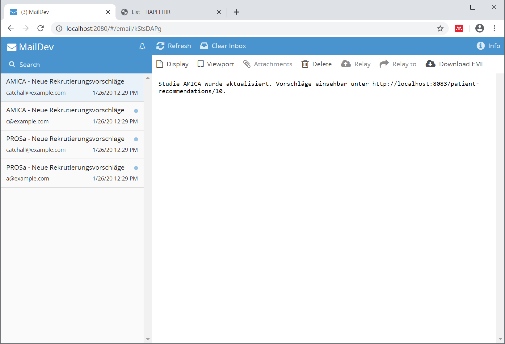

# notify - The Notification Module

## Setup for Development

Start a FHIR server (<http://localhost:8082/>), a maildev instance (<http://localhost:2080>), and the screening list module (<http://localhost:8083>):

```sh
docker-compose -f deploy/docker-compose.dev.yml up
```

Now start the notify module. You may also open the project in favorite IDE:

```sh
./gradlew bootRun
```

Check if the application startet correctly by visting <http://localhost:8083/> and checking if there are patient recommendations on the list.

Open <http://localhost:2080/> to view any emails created by the notification module. You can cause a change to the screening list and a creation of a notification email by running:

```sh
curl -X POST -H "Content-Type:application/json" --data "@./deploy/data/screening-list-sample.json" http://localhost:8082/fhir
```



You can also visit <http://localhost:8082/resource?serverId=home&pretty=false&resource=List> and manually edit the `List` resource.

### Notes for running on Linux

Replace the `webhook.endpoint` property of the notify module with the container host address, see <https://nickjanetakis.com/blog/docker-tip-65-get-your-docker-hosts-ip-address-from-in-a-container>.

#### Explanation

The notify module creates a subscription resource in the FHIR server. This resource defines a webhook endpoint which is invoked by the FHIR server whenever any screening list changes. In order for this to work, the FHIR server needs to be able to connect to the notify module over the network. However, if the webhook endpoint is set to a localhost address (for development), then this may not work as the FHIR container will try to call itself. For this reason, the default webhook endpoint is set to `host.docker.internal`, which resolves to the host node but may not work on Linux.
