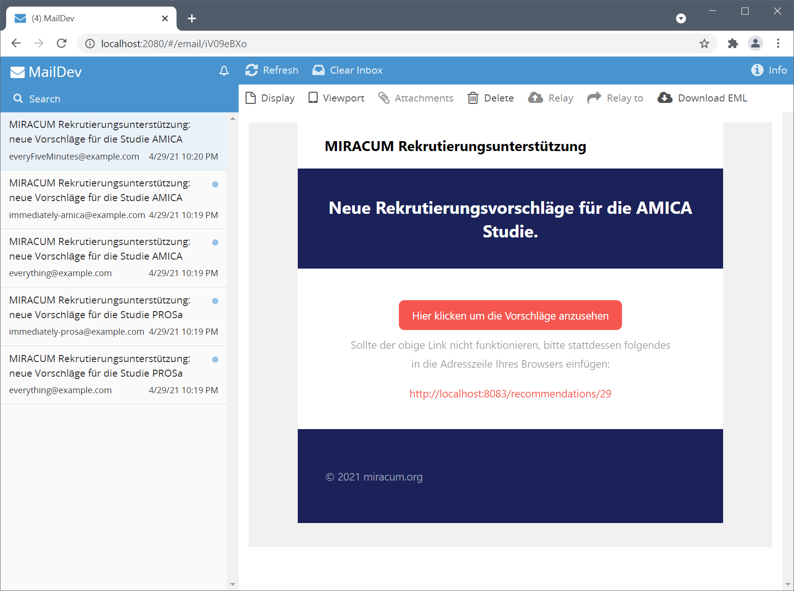

# notify - The Notification Module

## Setup for Development

Start a FHIR server (<http://localhost:8082/>), initialize it with sample data, and start the
screening list module (<http://localhost:8083>):

```sh
docker-compose -f deploy/docker-compose.dev.yml up
```

Check if the application started correctly by visiting <http://localhost:8083/> and checking if
there are patient recommendations on the list.

Now start the notify module (or open it in your IDE of choice):

```sh
./gradlew bootRun
```

Trigger updates in the FHIR-server for the screening list:

```sh
curl -X POST -H "Content-Type:application/json" --data "@./deploy/data/screening-list-sample.json" http://localhost:8082/fhir
```

(You can also visit <http://localhost:8082/resource?serverId=home&pretty=false&resource=List> and
manually edit the `List` resource.)

Visit <http://localhost:2080/> to see if the notifications have arrived:



### Notes for running on Linux

Replace the `webhook.endpoint` property of the notify module with the container host address,
see <https://nickjanetakis.com/blog/docker-tip-65-get-your-docker-hosts-ip-address-from-in-a-container>
.

#### Explanation

The notify module creates registered practitioners on startup in target FHIR server if not yet
added.

The notify module creates a subscription resource in the FHIR server. This resource defines a
webhook endpoint which is invoked by the FHIR server whenever any screening list changes.

In order for this to work, the FHIR server needs to be able to connect to the notify module over the
network. However, if the webhook endpoint is set to a localhost address (for development), then this
may not work as the FHIR container will try to call itself. For this reason, the default webhook
endpoint is set to `host.docker.internal`, which resolves to the host node but may not work on
Linux.

If subscription is triggered, app decides which subscribers need to be informed based on app config.
In config it can be defined, to which email address an email is sent ad hoc. Other messages are
stored on fhir server temporary as communciation resource with state "preparation". If timer event
occurs (e.g. every Thursday on 8 am) those messages are collected and sent to receiver email
address. If multiple subscriptions for one and the same receiver occurs, only one messages is stored
in fhir server and only one messages is sent by timer event for tuple of trial and receiver.
Messages are marked as "completed" when finished. Messages are marked as "entered-in-error" if
sending fails, e.g. when no valid email address is entered in config.

Please check before app start, that smtp credentials are valid. If mails could not be sent, they
need to be reset manually in fhir server.

## Configure Mail Receivers

```yaml
notify:
  rules:
    # create custom notification schedules using https://www.cronmaker.com
    # these are later referenced by each
    schedules:
      everyMorning: "0 0 8 1/1 * ? *"
      everyMonday: "0 0 8 ? * MON *"
      everyHour: "0 0 0/1 1/1 * ? *"
      everyFiveMinutes: "0 0/5 * 1/1 * ? *"

    # trials are identified by their acronym which corresponds to the cohort's title in atlas or the "[acronym=XYZ]" tag
    trials:
      # a value of '*' matches every trial, so 'everything@example.com' will receive an email whenever any screeninglist
      # gets updated.
      - acronym: "*"
        subscriptions:
          - email: "everything@example.com"

      - acronym: "PROSa"
        subscriptions:
          - email: "everyMorning@example.com"
            # each 'notify'-value corresponds to one schedule
            notify: "everyMorning"
            # a lack of a 'notify'-key with an associated schedule means that the user will be notified immediately.
          - email: "immediately-prosa@example.com"
          - email: "everyHour@example.com"
            notify: "everyHour"

      - acronym: "AMICA"
        subscriptions:
          - email: "immediately-amica@example.com"
          - email: "everyHour1@example.com"
            notify: "everyHour"
          - email: "everyHour2@example.com"
            notify: "everyHour"
          - email: "everyFiveMinutes@example.com"
            notify: "everyFiveMinutes"
```
